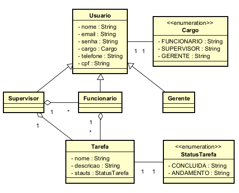

# Task Management System - A Web-Based Employee Task Tracking Solution

Uma aplicação web completa para que organizações possam gerenciar e acompanhar tarefas entre diferentes papéis (Gerentes, Supervisores e Funcionários), com atualizações de status em tempo real e relatórios detalhados.

O sistema oferece controle de acesso baseado em papéis, permitindo que:
- **Gerentes**: gerem relatórios.
- **Supervisores**: atribuam e monitorem tarefas.
- **Funcionários**: visualizem e atualizem suas tarefas atribuídas.

Construído com Java EE e SQLite, o sistema fornece uma interface web responsiva para gerenciamento e geração de relatórios em toda a organização.

**Nome completo e matrícula dos integrantes:**
-  **Anthony Clayton Barros de Jesus Carvalho | Matrícula: 12723110413**
-  **Anderson Silva Dantas Junior | Matrícula: 1272311567**
-  **Cauã Souza Conceição | Matrícula: 1272310702**
-  **Caio Sterphen Barbosa Santos | Matrícula: 12723115470**
-  **Eros Eloi Alves da Paixão | Matrícula : 12723126200**
-  **Italo da Conceicao Araujo | Matrícula: 12723114551**


## Video de Apresentação Hospedado no Youtube:
- **Link:** [Clique aqui pra ver a apresentação](https://www.youtube.com/watch?v=jgnxmZPWH2o)

## Modelo de Domínio



## 📁 Estrutura do Repositório

```
.
├── pom.xml                 
└── src/main               
    ├── java/org/sistema/acompanhamento/tarefas
    │   ├── controller      
    │   ├── exception       
    │   ├── model          
    │   ├── repository     
    │   ├── services       
    │   └── util           
    ├── resources
    │   ├── database.db   
    │   └── script.sql    
    └── webapp            
        ├── css           
        ├── js            
        └── WEB-INF
```

---

## ⚙️ Pré-requisitos

- [Java JDK 17](https://www.oracle.com/java/technologies/javase/jdk17-archive-downloads.html)
- [Apache Maven 3.6+](https://maven.apache.org/download.cgi)
- [Apache Tomcat 11.0.7+](https://tomcat.apache.org/download-11.cgi)

Uma IDEA, Recomendamos o [IntelliJ IDEA ](https://www.jetbrains.com/idea/download/?section=windows)

---

## 🚀 Instalação e Execução

### A. Executar com Docker (Recomendado)

#### Pré-requisitos:

- Ter o **Docker instalado no sistema**, seja via Docker Desktop (GUI) ou Docker CLI.
    - Para instalar: https://www.docker.com/products/docker-desktop/

#### Execução da aplicação via terminal (Docker CLI):

1. Baixe a imagem da aplicação hospedada no Docker Hub:
   ```bash
   docker pull cauaconceicao/a3-sdm-imagem
   ```

2. Crie e execute um contêiner com nome explícito:
   ```bash
   docker run -d -p 8080:8080 --name api-container cauaconceicao/a3-sdm-imagem
   ```

   Esse comando faz o seguinte:
- Cria um contêiner baseado na imagem `cauaconceicao/a3-sdm-imagem`.
- Mapeia a porta 8080 do contêiner para a porta 8080 da sua máquina.
- Define explicitamente o nome do contêiner como `api-container`.
- Inicia o servidor Apache Tomcat automaticamente dentro do contêiner.

3. Abra o navegador e acesse:  
   `http://localhost:8080`

#### Execução da aplicação via Docker Desktop (interface gráfica):

1. Abra o Docker Desktop.
2. Vá até a aba **Images** e clique em **Pull from Docker Hub**.
3. No campo de busca, procure por: `cauaconceicao/a3-sdm-imagem`
4. Após o download da imagem, localize-a em **Images**.
5. Clique em **Run**.
6. Configure:
- Porta local: `8080`
- Nome do contêiner: `api-container` (opcional, mas recomendado)
7. Clique em **Run Container**.
8. Acesse a aplicação em: `http://localhost:8080`

---

### B. Executar Manualmente (Sem Docker)

#### Pré-requisitos obrigatórios:

- Java 17 instalado e com variável de ambiente `JAVA_HOME` configurada
- Apache Maven instalado e com variável `MAVEN_HOME` configurada
- Apache Tomcat 11.0.7 configurado na máquina
- Git instalado para clonar o repositório do projeto

#### Passo a passo para execução local:

1. Clone o repositório do projeto:
   ```bash
   git clone https://github.com/CauaConceicao20/Sistema_de_acompanhamento_de_tarefas.git
   cd sistema-de-acompanhamento-de-tarefas
   ```

2. Compile o projeto e gere o pacote `.war`:
   ```bash
   mvn clean package
   ```

3. Copie o arquivo `.war` gerado (localizado em `/target`) para a pasta `webapps/` do Apache Tomcat.

4. Abra o terminal dentro da pasta `apache-tomcat-11.0.7\bin`.

5. Inicie o servidor Tomcat:
- Linux/Mac:
  ```bash
  ./bin/startup.sh
  ```
- Windows:
  ```bash
  .\bin\startup.bat
  ```

6. Acesse a aplicação via navegador:  
   `http://localhost:8080/nome-do-projeto`

   `http://localhost:8080/sistema-de-acompanhamento-de-tarefas-1.0-SNAPSHOT/login`

---

---

## 🔑 Login

- **Gerente**: acessa relatórios e visão geral
- **Supervisor**: gerencia tarefas e funcionários
- **Funcionário**: visualiza e atualiza tarefas
 
### Credenciais de Acesso
#### Gerente
- **Login**: carlos@empresa.com
- **Senha**: senha789
#### Supervisor
- **Login**: ana@empresa.com
- **Senha**: senha222
#### Funcionario
- **Login**: felipe@empresa.com
- **Senha**: senha459 

---

## 🧰 Solução de Problemas

### Erro: "Database file not found"
- Confirme que `database.db` está em `src/main/resources`
- Verifique permissões do arquivo
- Verifique se o driver JDBC do SQLite está incluído no `pom.xml`

### Erro: "User not authenticated"
- Limpe cookies do navegador
- Verifique `web.xml` para timeout de sessão
- Confirme login e senha corretos

### Erro: "Unable to generate report"
- Confirme se o usuário tem papel de Gerente
- Verifique conectividade com o banco
- Verifique se o ID do Supervisor existe

---

## 🔁 Fluxo de Dados

```
[Web Browser] 
    ↓ 
[Controllers] 
    ↓ 
[Services] 
    ↓ 
[Repositories] 
    ↓ 
[SQLite DB]
```

- Autenticação: `LoginController` → `LoginService`
- Tarefas: `TarefaController` → `TarefaService`
- Relatórios: controladores específicos → `RelatorioService`
- Conexão DB: centralizada via `DataBaseConnection`
- Sessões e validação de papéis: `ControllerUtils`
- DTOs separam camadas de forma limpa
- Lógica JS cliente separada por papel

---

## ✅ Observações Finais

Se você já tiver Java, Maven e Tomcat configurados corretamente e o repositório clonado, **não é necessário instalar nenhuma dependência adicional manualmente** — o Maven cuidará disso durante o `clean install`.

Para garantir que tudo funcione:

- Verifique as variáveis de ambiente: `JAVA_HOME`, `MAVEN_HOME`, `TOMCAT_HOME`, `PATH`
- Certifique-se de que seu Tomcat esteja com a porta 8080 disponível
- Confirme que o SQLite funciona corretamente no ambiente local
